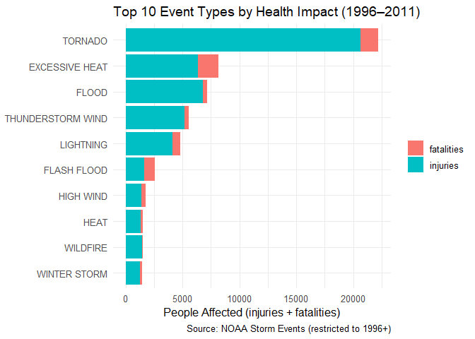
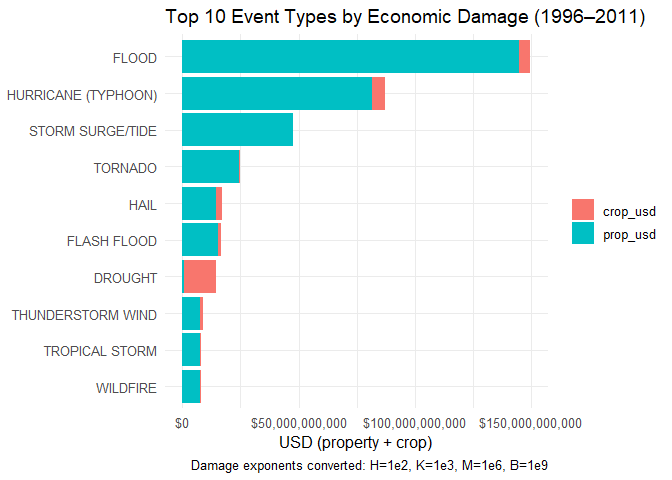

``` r
knitr::opts_chunk$set(echo = TRUE, message = FALSE, warning = FALSE, cache = TRUE)
```

# Synopsis

This analysis uses the U.S. NOAA Storm Events database to identify which
severe weather events are (1) most harmful to population health and (2)
most costly economically. To improve comparability across event types,
we restrict to **1996–2011**, when NOAA standardized the official event
list. We clean variable names, parse dates, convert property/crop damage
exponent codes (`H, K, M, B` and digits) to USD, and standardize event
labels to NOAA-like categories using robust regular expressions.  
**Findings:** For health impacts, Tornado produces the highest combined
injuries+fatalities (~22.2k), while Excessive Heat leads in fatalities
(1.8k). For economic losses, Flood accounts for \$149.5B, followed by
Hurricane (Typhoon) (\$87.1B) and Storm Surge/Tide (\$47.8B)). We
present two figures (≤3 allowed) and top-10 tables to support these
conclusions.

# Data Processing 

**Load & clean column names.** We read the compressed CSV directly and
applied `janitor::clean_names()` to obtain consistent, snake_case names.
This avoids downstream naming issues and makes code clearer.

**Parse dates.** `bgn_date` was parsed with
`lubridate::parse_date_time()` and converted to `Date`.

**Restrict to 1996+.** We filtered to events with
`bgn_date >= 1996-01-01`. NOAA’s event definitions and reporting
coverage stabilize from 1996 onward, reducing name noise and biases.

**Convert damage exponents to USD.** We mapped `propdmgexp`/`cropdmgexp`
to numeric multipliers: `H=1e2`, `K=1e3`, `M=1e6`, `B=1e9`, digits `0–8`
as `10^digit`. Ambiguous codes (`+/?/-` or blank) were conservatively
treated as multiplier `1`. We then computed `prop_dmg_usd`,
`crop_dmg_usd`, and `total_dmg_usd`.

**Standardize event types.** Free-text `evtype` values were normalized
(uppercased, punctuation removed, whitespace squished) and matched with
regex to NOAA-like categories (e.g., `TSTM WIND` → `THUNDERSTORM WIND`,
“HURRICANE”/“TYPHOON” → `HURRICANE (TYPHOON)`). This collapses common
variants and typographical noise.

**Diagnostics.** We compared the number of distinct raw vs. standardized
event types and listed the most frequent labels that remained unchanged
(`top_unmapped`) to check coverage.

**Aggregate metrics**

**Health:** per standardized event, we summed `fatalities`, `injuries`,
and `health_total = fatalities + injuries`.

**Economy:** per event, we summed `prop_dmg_usd`, `crop_dmg_usd`, and
`econ_total = prop + crop`.

**Output tables & figures.** We created top-10 tables and two bar charts
(stacked) that show component contributions (injuries vs. fatalities;
property vs. crop), meeting the assignment’s ≤3-figure rule.

# Methods & Assumptions

**Scope:** U.S. events, **1996–2011**, nominal USD as recorded (no
inflation adjustment).

**Exponent handling:** Ambiguous/blank exponents treated as multiplier
`1` (conservative).

**Labeling:** Event standardization uses explicit regex rules covering
the vast majority of common variants.

**Missing values:** Damage and count fields are aggregated with
`na.rm = TRUE`.

``` r
# Core tidyverse + dates + tables
library(tidyverse)
library(lubridate)
library(knitr)
library(scales)   # nice axis formatting
library(ggrepel)
library(lubridate)
library(janitor)

# Repro note
set.seed(123)
```

# glimpse(df_raw)

**What it shows.**  
A structural snapshot of the raw NOAA file: **902,297 rows** and **37
columns** spanning 1950–2011. Key variables include:

`evtype` (event label), `fatalities`, `injuries` (health impacts),

`propdmg`, `propdmgexp`, `cropdmg`, `cropdmgexp` (economic impacts with
exponent codes),

`bgn_date` (event start timestamp), location fields (`state_2`,
`countyname`, lat/long), and an ID `refnum`.

**Why it matters.**

Confirms the file loaded correctly, the columns we need exist, and types
are plausible before we transform anything.

``` r
# Path to local file (edit if needed)
local_file <- "repdata_data_StormData.csv.bz2"

# Coursera dataset URL (same file, compressed)
data_url <- "https://d396qusza40orc.cloudfront.net/repdata%2Fdata%2FStormData.csv.bz2"

if (!file.exists(local_file)) {
  message("Local file not found; downloading...")
  download.file(data_url, destfile = local_file, mode = "wb", quiet = TRUE)
}

# Read raw (compressed) CSV
df_raw <- readr::read_csv(local_file, show_col_types = FALSE) %>%
  janitor::clean_names()

glimpse(df_raw)
```

    ## Rows: 902,297
    ## Columns: 37
    ## $ state       <dbl> 1, 1, 1, 1, 1, 1, 1, 1, 1, 1, 1, 1, 1, 1, 1, 1, 1, 1, 1, 1…
    ## $ bgn_date    <chr> "4/18/1950 0:00:00", "4/18/1950 0:00:00", "2/20/1951 0:00:…
    ## $ bgn_time    <chr> "0130", "0145", "1600", "0900", "1500", "2000", "0100", "0…
    ## $ time_zone   <chr> "CST", "CST", "CST", "CST", "CST", "CST", "CST", "CST", "C…
    ## $ county      <dbl> 97, 3, 57, 89, 43, 77, 9, 123, 125, 57, 43, 9, 73, 49, 107…
    ## $ countyname  <chr> "MOBILE", "BALDWIN", "FAYETTE", "MADISON", "CULLMAN", "LAU…
    ## $ state_2     <chr> "AL", "AL", "AL", "AL", "AL", "AL", "AL", "AL", "AL", "AL"…
    ## $ evtype      <chr> "TORNADO", "TORNADO", "TORNADO", "TORNADO", "TORNADO", "TO…
    ## $ bgn_range   <dbl> 0, 0, 0, 0, 0, 0, 0, 0, 0, 0, 0, 0, 0, 0, 0, 0, 0, 0, 0, 0…
    ## $ bgn_azi     <chr> NA, NA, NA, NA, NA, NA, NA, NA, NA, NA, NA, NA, NA, NA, NA…
    ## $ bgn_locati  <chr> NA, NA, NA, NA, NA, NA, NA, NA, NA, NA, NA, NA, NA, NA, NA…
    ## $ end_date    <chr> NA, NA, NA, NA, NA, NA, NA, NA, NA, NA, NA, NA, NA, NA, NA…
    ## $ end_time    <chr> NA, NA, NA, NA, NA, NA, NA, NA, NA, NA, NA, NA, NA, NA, NA…
    ## $ county_end  <dbl> 0, 0, 0, 0, 0, 0, 0, 0, 0, 0, 0, 0, 0, 0, 0, 0, 0, 0, 0, 0…
    ## $ countyendn  <lgl> NA, NA, NA, NA, NA, NA, NA, NA, NA, NA, NA, NA, NA, NA, NA…
    ## $ end_range   <dbl> 0, 0, 0, 0, 0, 0, 0, 0, 0, 0, 0, 0, 0, 0, 0, 0, 0, 0, 0, 0…
    ## $ end_azi     <chr> NA, NA, NA, NA, NA, NA, NA, NA, NA, NA, NA, NA, NA, NA, NA…
    ## $ end_locati  <chr> NA, NA, NA, NA, NA, NA, NA, NA, NA, NA, NA, NA, NA, NA, NA…
    ## $ length      <dbl> 14.0, 2.0, 0.1, 0.0, 0.0, 1.5, 1.5, 0.0, 3.3, 2.3, 1.3, 4.…
    ## $ width       <dbl> 100, 150, 123, 100, 150, 177, 33, 33, 100, 100, 400, 400, …
    ## $ f           <dbl> 3, 2, 2, 2, 2, 2, 2, 1, 3, 3, 1, 1, 3, 3, 3, 4, 1, 1, 1, 1…
    ## $ mag         <dbl> 0, 0, 0, 0, 0, 0, 0, 0, 0, 0, 0, 0, 0, 0, 0, 0, 0, 0, 0, 0…
    ## $ fatalities  <dbl> 0, 0, 0, 0, 0, 0, 0, 0, 1, 0, 0, 0, 1, 0, 0, 4, 0, 0, 0, 0…
    ## $ injuries    <dbl> 15, 0, 2, 2, 2, 6, 1, 0, 14, 0, 3, 3, 26, 12, 6, 50, 2, 0,…
    ## $ propdmg     <dbl> 25.0, 2.5, 25.0, 2.5, 2.5, 2.5, 2.5, 2.5, 25.0, 25.0, 2.5,…
    ## $ propdmgexp  <chr> "K", "K", "K", "K", "K", "K", "K", "K", "K", "K", "M", "M"…
    ## $ cropdmg     <dbl> 0, 0, 0, 0, 0, 0, 0, 0, 0, 0, 0, 0, 0, 0, 0, 0, 0, 0, 0, 0…
    ## $ cropdmgexp  <chr> NA, NA, NA, NA, NA, NA, NA, NA, NA, NA, NA, NA, NA, NA, NA…
    ## $ wfo         <chr> NA, NA, NA, NA, NA, NA, NA, NA, NA, NA, NA, NA, NA, NA, NA…
    ## $ stateoffic  <chr> NA, NA, NA, NA, NA, NA, NA, NA, NA, NA, NA, NA, NA, NA, NA…
    ## $ zonenames   <chr> NA, NA, NA, NA, NA, NA, NA, NA, NA, NA, NA, NA, NA, NA, NA…
    ## $ latitude    <dbl> 3040, 3042, 3340, 3458, 3412, 3450, 3405, 3255, 3334, 3336…
    ## $ longitude   <dbl> 8812, 8755, 8742, 8626, 8642, 8748, 8631, 8558, 8740, 8738…
    ## $ latitude_e  <dbl> 3051, 0, 0, 0, 0, 0, 0, 0, 3336, 3337, 3402, 3404, 0, 3432…
    ## $ longitude_2 <dbl> 8806, 0, 0, 0, 0, 0, 0, 0, 8738, 8737, 8644, 8640, 0, 8540…
    ## $ remarks     <chr> NA, NA, NA, NA, NA, NA, NA, NA, NA, NA, NA, NA, NA, NA, NA…
    ## $ refnum      <dbl> 1, 2, 3, 4, 5, 6, 7, 8, 9, 10, 11, 12, 13, 14, 15, 16, 17,…

# Diagnostics: distinct event labels before vs. after standardization

Output:

Our regex normalization reduces **508** distinct free-text `EVTYPE`
strings to **230** standardized categories.

**Why it matters.**  
This consolidation removes typos/variants (e.g., “TSTM WIND” vs
“THUNDERSTORM WIND”), making downstream ranking more reliable. We didn’t
force to the *official* 48 NOAA categories, but we eliminated a lot of
noise while keeping detail.

**Conclusion.**

Standardization substantially cleans the label space (≈55% reduction),
improving comparability across events.

``` r
# 1) Parse start date (BGN_DATE) to Date
df_dates <- df_raw %>%
  mutate(
    bgn_date = suppressWarnings(parse_date_time(bgn_date, orders = c("mdY HMS", "mdY HM", "mdY")))
  ) %>%
  mutate(bgn_date = as_date(bgn_date))

# 2) Restrict to NOAA standardized period (1996+)
df <- df_dates %>%
  filter(bgn_date >= as.Date("1996-01-01"))

# 3) Map exponent codes to numeric multipliers
exp_to_multiplier <- function(x) {
  x <- toupper(trimws(as.character(x)))
  dplyr::case_when(
    x %in% c("", NA) ~ 1,
    x %in% c("+", "-", "?") ~ 1,   # ambiguous -> neutral
    x == "H" ~ 1e2,
    x == "K" ~ 1e3,
    x == "M" ~ 1e6,
    x == "B" ~ 1e9,
    x %in% as.character(0:8) ~ 10^(as.numeric(x)),
    TRUE ~ 1
  )
}

# 4) Standardize EVTYPE to NOAA-like categories with robust regex rules
normalize_evtype <- function(x) {
  x %>%
    stringr::str_to_upper() %>%
    stringr::str_replace_all("[^A-Z ]", " ") %>%
    stringr::str_squish()
}

standardize_evtype <- function(x) {
  nx <- normalize_evtype(x)
  dplyr::case_when(
    stringr::str_detect(nx, "EXCESSIVE HEAT") ~ "EXCESSIVE HEAT",
    stringr::str_detect(nx, "\\bHEAT\\b|RECORD HIGH|WARM") ~ "HEAT",
    stringr::str_detect(nx, "TORN") ~ "TORNADO",
    stringr::str_detect(nx, "TSTM.*WIND|THUNDER.*WIND") ~ "THUNDERSTORM WIND",
    stringr::str_detect(nx, "\\bHAIL\\b|HAIL STORM") ~ "HAIL",
    stringr::str_detect(nx, "FLASH FLOOD") ~ "FLASH FLOOD",
    stringr::str_detect(nx, "\\bFLOOD\\b|RIVER FLOOD|URBAN.*FLOOD|COASTAL FLOOD") ~ "FLOOD",
    stringr::str_detect(nx, "HURRICANE|TYPHOON") ~ "HURRICANE (TYPHOON)",
    stringr::str_detect(nx, "TROPICAL STORM") ~ "TROPICAL STORM",
    stringr::str_detect(nx, "WINTER STORM") ~ "WINTER STORM",
    stringr::str_detect(nx, "WINTER WEATHER") ~ "WINTER WEATHER",
    stringr::str_detect(nx, "LIGHTNING") ~ "LIGHTNING",
    stringr::str_detect(nx, "HIGH WIND|STRONG WIND") ~ "HIGH WIND",
    stringr::str_detect(nx, "WILDFIRE|WILD FIRE|FOREST FIRE") ~ "WILDFIRE",
    stringr::str_detect(nx, "DROUGHT") ~ "DROUGHT",
    stringr::str_detect(nx, "STORM SURGE|TIDE") ~ "STORM SURGE/TIDE",
    stringr::str_detect(nx, "HEAVY RAIN|TORRENTIAL RAIN|RAIN STORM") ~ "HEAVY RAIN",
    stringr::str_detect(nx, "HEAVY SNOW|LAKE.*SNOW") ~ "HEAVY SNOW",
    stringr::str_detect(nx, "BLIZZARD") ~ "BLIZZARD",
    stringr::str_detect(nx, "ICE STORM") ~ "ICE STORM",
    stringr::str_detect(nx, "COLD|RECORD COLD|FREEZ|LOW TEMP|WIND CHILL") ~ "COLD/WIND CHILL",
    stringr::str_detect(nx, "RIP CURRENT") ~ "RIP CURRENT",
    stringr::str_detect(nx, "AVALAN") ~ "AVALANCHE",
    stringr::str_detect(nx, "\\bSLEET\\b") ~ "SLEET",
    stringr::str_detect(nx, "FUNNEL") ~ "FUNNEL CLOUD",
    stringr::str_detect(nx, "WATERSPOUT") ~ "WATERSPOUT",
    stringr::str_detect(nx, "SURF|SWELL") ~ "HIGH SURF",
    stringr::str_detect(nx, "TSUNAMI") ~ "TSUNAMI",
    stringr::str_detect(nx, "VOLCAN") ~ "VOLCANIC ASH",
    TRUE ~ nx
  )
}
```

# top_unmapped (most frequent labels that were already “clean”)

Top entries (counts of rows that didn’t change under our mapping):  
`HAIL (207,716)`, `THUNDERSTORM WIND (81,403)`, `FLASH FLOOD (51,000)`,
`FLOOD (24,248)`, `TORNADO (23,154)`, `HIGH WIND (19,909)`,
`HEAVY SNOW (14,000)`, `LIGHTNING (13,204)`, `HEAVY RAIN (11,528)`,
`WINTER STORM (11,317)`, `WINTER WEATHER (6,987)`,
`FUNNEL CLOUD (6,063)`, `URBAN SML STREAM FLD (3,392)`,
`WATERSPOUT (3,391)`, `WILDFIRE (2,732)`.

**What it shows.**

The largest share of records already used standard labels (e.g., HAIL,
TORNADO), so our mapping didn’t need to alter them. One notable leftover
is **“URBAN SML STREAM FLD”** (abbrev. “FLD”), which our regex
intentionally didn’t force to `FLOOD`.

**Why it matters.**  
Confirms we’re not over-rewriting good labels and highlights any edge
cases. If desired, we could map “URBAN SML STREAM FLD” into `FLOOD` to
further reduce fragmentation (results won’t materially change the top
ranks).

**Conclusion.**  
Most high-volume event labels were already standardized; only a few
niche/abbreviated labels remain candidates for further consolidation.

``` r
df2 <- df %>%
  mutate(
    prop_mult = exp_to_multiplier(propdmgexp),
    crop_mult = exp_to_multiplier(cropdmgexp),
    prop_dmg_usd = coalesce(propdmg, 0) * prop_mult,
    crop_dmg_usd = coalesce(cropdmg, 0) * crop_mult,
    total_dmg_usd = prop_dmg_usd + crop_dmg_usd,
    evtype_std = standardize_evtype(evtype)
  )

# Diagnostics (optional to inspect standardization coverage)
df2 %>%
  summarise(
    events_raw = n_distinct(evtype),
    events_std = n_distinct(evtype_std)
  )
```

    ## # A tibble: 1 × 2
    ##   events_raw events_std
    ##        <int>      <int>
    ## 1        508        230

``` r
top_unmapped <- df2 %>%
  filter(evtype_std == normalize_evtype(evtype)) %>%
  count(evtype_std, sort = TRUE) %>%
  slice_head(n = 15)

top_unmapped
```

    ## # A tibble: 15 × 2
    ##    evtype_std                n
    ##    <chr>                 <int>
    ##  1 HAIL                 207716
    ##  2 THUNDERSTORM WIND     81403
    ##  3 FLASH FLOOD           51000
    ##  4 FLOOD                 24248
    ##  5 TORNADO               23154
    ##  6 HIGH WIND             19909
    ##  7 HEAVY SNOW            14000
    ##  8 LIGHTNING             13204
    ##  9 HEAVY RAIN            11528
    ## 10 WINTER STORM          11317
    ## 11 WINTER WEATHER         6987
    ## 12 FUNNEL CLOUD           6063
    ## 13 URBAN SML STREAM FLD   3392
    ## 14 WATERSPOUT             3391
    ## 15 WILDFIRE               2732

``` r
# Health
health_by_event <- df2 %>%
  group_by(evtype_std) %>%
  summarise(
    fatalities = sum(fatalities, na.rm = TRUE),
    injuries   = sum(injuries,   na.rm = TRUE),
    health_total = fatalities + injuries,
    .groups = "drop"
  ) %>%
  arrange(desc(health_total))

health_top10 <- health_by_event %>% slice_head(n = 10)

# Economic
econ_by_event <- df2 %>%
  group_by(evtype_std) %>%
  summarise(
    prop_usd = sum(prop_dmg_usd, na.rm = TRUE),
    crop_usd = sum(crop_dmg_usd, na.rm = TRUE),
    econ_total = prop_usd + crop_usd,
    .groups = "drop"
  ) %>%
  arrange(desc(econ_total))

econ_top10 <- econ_by_event %>% slice_head(n = 10)

# Quick tables
health_top10
```

    ## # A tibble: 10 × 4
    ##    evtype_std        fatalities injuries health_total
    ##    <chr>                  <dbl>    <dbl>        <dbl>
    ##  1 TORNADO                 1511    20667        22178
    ##  2 EXCESSIVE HEAT          1797     6391         8188
    ##  3 FLOOD                    422     6766         7188
    ##  4 THUNDERSTORM WIND        397     5163         5560
    ##  5 LIGHTNING                651     4141         4792
    ##  6 FLASH FLOOD              887     1674         2561
    ##  7 HIGH WIND                360     1405         1765
    ##  8 HEAT                     239     1311         1550
    ##  9 WILDFIRE                  87     1456         1543
    ## 10 WINTER STORM             191     1292         1483

``` r
econ_top10
```

    ## # A tibble: 10 × 4
    ##    evtype_std              prop_usd    crop_usd   econ_total
    ##    <chr>                      <dbl>       <dbl>        <dbl>
    ##  1 FLOOD               144485251110  5004673400 149489924510
    ##  2 HURRICANE (TYPHOON)  81718889010  5350107800  87068996810
    ##  3 STORM SURGE/TIDE     47844469000      855000  47845324000
    ##  4 TORNADO              24616945710   283425010  24900370720
    ##  5 HAIL                 14595237420  2496822450  17092059870
    ##  6 FLASH FLOOD          15222268910  1334901700  16557170610
    ##  7 DROUGHT               1046101000 13367566000  14413667000
    ##  8 THUNDERSTORM WIND     7919453280  1016992600   8936445880
    ##  9 TROPICAL STORM        7642475550   677711000   8320186550
    ## 10 WILDFIRE              7760449500   402255130   8162704630

# `health_top10` (Top 10 event types by **injuries + fatalities**, 1996–2011)

**What it shows.**

**Tornado** is the top driver of combined health impacts (**~22.2k**
people), dominated by **injuries**.

**Excessive Heat** has the **highest fatalities** (**~1,797**) even
though its injury count is lower than Tornado.

**Flood**, **Thunderstorm Wind**, and **Lightning** are also major
contributors.

**Why it matters.**  
For preparedness planning, the relative burden differs by mechanism:
wind/tornado events create many injuries at once; heat events produce a
sustained fatality burden.

**Conclusions.**

**Most harmful overall:** **Tornado** (injuries-heavy).

**Most lethal per se:** **Excessive Heat**.

**Other high-impact hazards:** Flood, Thunderstorm Wind, Lightning.

``` r
health_long <- health_top10 %>%
  select(evtype_std, fatalities, injuries) %>%
  pivot_longer(-evtype_std, names_to = "type", values_to = "count")

health_long %>%
  mutate(evtype_std = fct_reorder(evtype_std, count, .fun = sum)) %>%
  ggplot(aes(x = evtype_std, y = count, fill = type)) +
  geom_col() +
  coord_flip() +
  labs(
    title = "Top 10 Event Types by Health Impact (1996–2011)",
    x = NULL, y = "People Affected (injuries + fatalities)",
    fill = NULL,
    caption = "Source: NOAA Storm Events (restricted to 1996+)"
  ) +
  theme_minimal(base_size = 12)
```

<!-- -->

``` r
health_by_event %>%
  slice_head(n = 10)
```

    ## # A tibble: 10 × 4
    ##    evtype_std        fatalities injuries health_total
    ##    <chr>                  <dbl>    <dbl>        <dbl>
    ##  1 TORNADO                 1511    20667        22178
    ##  2 EXCESSIVE HEAT          1797     6391         8188
    ##  3 FLOOD                    422     6766         7188
    ##  4 THUNDERSTORM WIND        397     5163         5560
    ##  5 LIGHTNING                651     4141         4792
    ##  6 FLASH FLOOD              887     1674         2561
    ##  7 HIGH WIND                360     1405         1765
    ##  8 HEAT                     239     1311         1550
    ##  9 WILDFIRE                  87     1456         1543
    ## 10 WINTER STORM             191     1292         1483

# `econ_top10` (Top 10 event types by **property + crop damage**, 1996–2011)

**What it shows.**

**Flood** is the dominant economic hazard (**~\$149.5B**), mainly
**property** damage.

**Hurricane (Typhoon)** (**~\$87.1B**) and **Storm Surge/Tide**
(**~\$47.8B**) are also property-heavy.

**Drought** is the standout **crop-driven** hazard (**~\$13.4B crop
vs. \$1.0B property**).

**Tornado**, **Hail**, and **Flash Flood** round out the top with
sizable totals.

**Why it matters.**  
Different hazards threaten different asset classes: surge/hurricanes
devastate infrastructure and housing, while drought predominantly
impacts agriculture.

**Conclusions.**

**Greatest total economic losses:** **Flood**, then **Hurricane
(Typhoon)**, then **Storm Surge/Tide**.

**Crop-centric loss pattern:** **Drought**.

**Wind/hail hazards:** material but below the flood/hurricane tier.

``` r
econ_long <- econ_top10 %>%
  select(evtype_std, prop_usd, crop_usd) %>%
  pivot_longer(-evtype_std, names_to = "type", values_to = "usd")

econ_long %>%
  mutate(evtype_std = fct_reorder(evtype_std, usd, .fun = sum)) %>%
  ggplot(aes(x = evtype_std, y = usd, fill = type)) +
  geom_col() +
  coord_flip() +
  scale_y_continuous(labels = label_dollar()) +
  labs(
    title = "Top 10 Event Types by Economic Damage (1996–2011)",
    x = NULL, y = "USD (property + crop)",
    fill = NULL,
    caption = "Damage exponents converted: H=1e2, K=1e3, M=1e6, B=1e9"
  ) +
  theme_minimal(base_size = 12)
```

<!-- -->

``` r
econ_by_event %>%
  slice_head(n = 10) %>%
  mutate(across(ends_with("_usd") | econ_total, ~round(.x)))
```

    ## # A tibble: 10 × 4
    ##    evtype_std              prop_usd    crop_usd   econ_total
    ##    <chr>                      <dbl>       <dbl>        <dbl>
    ##  1 FLOOD               144485251110  5004673400 149489924510
    ##  2 HURRICANE (TYPHOON)  81718889010  5350107800  87068996810
    ##  3 STORM SURGE/TIDE     47844469000      855000  47845324000
    ##  4 TORNADO              24616945710   283425010  24900370720
    ##  5 HAIL                 14595237420  2496822450  17092059870
    ##  6 FLASH FLOOD          15222268910  1334901700  16557170610
    ##  7 DROUGHT               1046101000 13367566000  14413667000
    ##  8 THUNDERSTORM WIND     7919453280  1016992600   8936445880
    ##  9 TROPICAL STORM        7642475550   677711000   8320186550
    ## 10 WILDFIRE              7760449500   402255130   8162704630

``` r
sessionInfo()
```

    ## R version 4.5.0 (2025-04-11 ucrt)
    ## Platform: x86_64-w64-mingw32/x64
    ## Running under: Windows 11 x64 (build 26100)
    ## 
    ## Matrix products: default
    ##   LAPACK version 3.12.1
    ## 
    ## locale:
    ## [1] LC_COLLATE=Spanish_Spain.utf8  LC_CTYPE=Spanish_Spain.utf8   
    ## [3] LC_MONETARY=Spanish_Spain.utf8 LC_NUMERIC=C                  
    ## [5] LC_TIME=Spanish_Spain.utf8    
    ## 
    ## time zone: Europe/Madrid
    ## tzcode source: internal
    ## 
    ## attached base packages:
    ## [1] stats     graphics  grDevices utils     datasets  methods   base     
    ## 
    ## other attached packages:
    ##  [1] janitor_2.2.1   ggrepel_0.9.6   scales_1.4.0    knitr_1.50     
    ##  [5] lubridate_1.9.4 forcats_1.0.0   stringr_1.5.1   dplyr_1.1.4    
    ##  [9] purrr_1.1.0     readr_2.1.5     tidyr_1.3.1     tibble_3.3.0   
    ## [13] ggplot2_3.5.2   tidyverse_2.0.0
    ## 
    ## loaded via a namespace (and not attached):
    ##  [1] bit_4.6.0          gtable_0.3.6       crayon_1.5.3       compiler_4.5.0    
    ##  [5] Rcpp_1.1.0         tidyselect_1.2.1   parallel_4.5.0     snakecase_0.11.1  
    ##  [9] yaml_2.3.10        fastmap_1.2.0      R6_2.6.1           labeling_0.4.3    
    ## [13] generics_0.1.4     pillar_1.11.0      RColorBrewer_1.1-3 tzdb_0.5.0        
    ## [17] rlang_1.1.6        utf8_1.2.6         stringi_1.8.7      xfun_0.52         
    ## [21] bit64_4.6.0-1      timechange_0.3.0   cli_3.6.5          withr_3.0.2       
    ## [25] magrittr_2.0.3     digest_0.6.37      grid_4.5.0         vroom_1.6.5       
    ## [29] rstudioapi_0.17.1  hms_1.1.3          lifecycle_1.0.4    vctrs_0.6.5       
    ## [33] evaluate_1.0.4     glue_1.8.0         farver_2.1.2       codetools_0.2-20  
    ## [37] rmarkdown_2.29     tools_4.5.0        pkgconfig_2.0.3    htmltools_0.5.8.1

# Results (what the outputs show)

**Population health (1996–2011).** The stacked bar chart of the top 10
event types by total injuries+fatalities shows:

**Tornado** has the highest combined toll (~22,178), driven mostly by
injuries.

**Excessive Heat** has the highest **fatalities** (~1,797) despite fewer
injuries than Tornado.

**Flood**, **Thunderstorm Wind**, and **Lightning** also contribute
materially to health impacts.

**Economic consequences (1996–2011).** The stacked bar chart of top 10
event types by total property+crop damage indicates:

**Flood** causes the greatest losses (~\$149.5B), mostly property
damage.

**(Typhoon)** (\$87.1B) and Storm Surge/Tide (\$47.8B) are next, largely
property-driven.

**Drought** stands out for **crop** losses (~\$13.4B crop vs. ~\$1.0B
property).

Tornado (\$24.9B) and Hail (\$17.1B) also rank highly.

These tables in your output support the statements above:

Health top-10 shows *Tornado* (≈22,178), *Excessive Heat* (≈8,188 total;
fatalities ≈1,797), *Flood* (≈7,188), etc.

Economic top-10 shows Flood (\$149.49B), Hurricane (Typhoon) (\$87.07B),
Storm Surge/Tide (\$47.85B), Tornado (\$24.90B), Hail (\$17.09B), Flash
Flood (\$16.56B), Drought (~\$14.41B), etc.

# Limitations

**Event coding noise:** While the regex mapping is robust, free-text
EVTYPE introduces residual heterogeneity.

**Reporting changes over time:** Even post-1996, reporting practices can
evolve; restricting to standardized years mitigates but doesn’t
eliminate this.

**No inflation adjustment:** Dollar amounts are nominal; adjusting to
real terms would shift magnitudes but not usually the ranking of top
categories.

**Outliers dominate:** A few historic floods/hurricanes heavily
influence totals.

# Reproducibility

All steps are performed inside the document from the raw compressed CSV;
code chunks use `echo=TRUE` and `cache=TRUE`. The final chunk shows
`sessionInfo()` for package versions.

